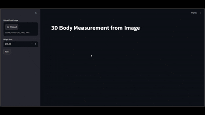

# 3D Body Measurement from a Single Image

This repository contains the source code for a 3D Body Measurement application, an AI-powered tool that estimates full-body 3D shape, pose, and real-world geometric measurements from a single front-facing photograph.

The system employs a sophisticated multi-stage computer vision pipeline, leveraging state-of-the-art models for segmentation, pose estimation, and 3D parametric body reconstruction.

## Demo

<p align="center">

</p>

## System Architecture Overview

This section describes the detailed workflow of the application, as illustrated in the architecture diagram below.

The application follows a linear, six-step pipeline to process a 2D image into a metric-accurate 3D model and measurement data.

[]()

### 1\. User Interaction & Input (Streamlit UI)

The frontend is built using **Streamlit**, providing an intuitive and interactive user interface.

  * **Inputs:** The user is required to upload a **Front-Facing Photo** (via `st.file_uploader`) and provide their **Height (cm)** (via `st.number_input`).
  * **State Management:** An internal state machine (`st.session_state.analyzed`) ensures the complex processing only runs upon a user click and resets if input data changes.
  * **Resource Caching:** To optimize performance and memory, all heavy deep learning models are loaded once and cached (`@st.cache_resource`).

### 2\. 2D Human Segmentation (YOLOSegmentationModel)

The first processing step involves isolating the human subject from the background.

  * **Model:** We use the Ultralytics **YOLOv8 Nano-Segmentation** (`yolov8n-seg.pt`) model for speed and efficiency.
  * **Process:** The model analyzes the input image to identify all objects and generates class-specific masks. Our code specifically filters for Class 0, which corresponds to "person".
  * **Output:** A 2D **Binary Mask** (numpy array) where human pixels are white (255) and everything else is black (0).

### 3\. 2D Pose Estimation (OpenCVPoseModel)

Simultaneously or sequentially, the system estimates the user's skeletal pose to understand their posture.

  * **Model:** A pre-trained **OpenPose** architecture (prototxt and caffemodel) is executed using OpenCV’s Deep Neural Network (`cv2.dnn`) module.
  * **Process:** The model calculates joint heatmaps. Our implementation extracts probability maps and coordinates for **18 key human joints** (nose, shoulders, elbows, hips, knees, etc.).
  * **Output:** A dictionary of **2D Joint Coordinates** mapping the (x, y) location of each joint on the image.

### 4\. 3D Body Reconstruction (PyTorchSMPLReconstructor)

This is the core mathematical and statistical engine that bridges 2D to 3D. It is implemented in **PyTorch**.

  * **Model:** We utilize the **SMPL (Skinned Multi-Person Linear)** model, a standard parametric human body model, managed via the `smplx` library.
  * **Process:** An optimization loop (or similar mechanism) iteratively adjusts SMPL parameters:
      * **Shape parameters (betas)**
      * **Pose parameters (body\_pose)**
        These parameters are conceptually tuned to make the 3D model's silhouette and joint locations align perfectly with the inputs from steps 2 and 3.
  * **Output:** A 3D mesh representation (trimesh.Trimesh object) with vertices and faces. Note: The initial mesh is unitless (not scaled to real world).

### 5\. Real-World Scaling & Measurement Extraction

The unitless 3D mesh is now converted into a real-world, metric-accurate model.

  * **Scale Mesh:** The system uses the user’s provided **Height (cm)** from Step 1. It measures the vertical bounding box of the generated 3D mesh and calculates a scale factor to multiply every vertex, creating a metric-scaled 3D mesh.
  * **Extract Measurements:** Using computational geometry and geometric slicing algorithms, specific measurements are calculated from the scaled mesh:
      * **Circumferences:** Chest, waist, hips.
      * **Linear distances:** Inseam, arm length.
  * **Output:** A fully-scaled 3D mesh and a list of measurements.

### 6\. Visualization & Rendering

The final step is to present all analyzed information to the user in a visually clear manner.

  * **Segmentation Tab (OpenCV):** Displays the original image with the generated segmentation mask as a semi-transparent green overlay (`cv2.addWeighted`).
  * **3D Mesh Tab (Plotly):** Renders the final, metric-scaled, solid 3D body model using `go.Mesh3d`, allowing user interaction (rotation, zoom).
  * **Wireframe Tab (Plotly):** Shows the underlying topological grid of the SMPL model using `go.Scatter3d`, forcing a white background for better visibility.
  * **Measurements Tab (JSON):** Outputs the final data in a clean JSON format and as a formatted list.

-----

##  Technology Stack

This project is built using the following core libraries and technologies:

| Category | Component | Library/Model | Details |
| :--- | :--- | :--- | :--- |
| **Framework** | UI & State | Streamlit | Complete app lifecycle management |
| **AI - Seg** | segmentation | Ultralytics YOLOv8 | `yolov8n-seg.pt` |
| **AI - Pose** | pose estimation | OpenCV + OpenPose | `cv2.dnn` module, `pose_deploy_linevec.prototxt` |
| **AI - 3D** | Body Modeling | smplx + PyTorch | SMPL Parametric model and optimization |
| **3D Data** | Mesh ops | trimesh | Mesh creation, scaling, slicing |
| **Rendering** | 2D Visualization | OpenCV | `cv2.addWeighted` for mask overlay |
| **Rendering** | 3D Visualization | Plotly | `go.Mesh3d`, `go.Scatter3d` for interactive models |

## Prerequisites & Setup

Ensure you have a Python environment (Python 3.8+ recommended). This project depends heavily on specific versions of computer vision and deep learning libraries.

### Clone the Repository

```bash
git clone https://github.com/Tanupvats/3D-Body-Measurement-from-a-Single-Image.git
cd 3D-Body-Measurement-from-a-Single-Image
```

### Install Dependencies

It is highly recommended to use a virtual environment.

```bash
pip install -r requirements.txt
```

*(You will need to create a `requirements.txt` file listing all the libraries in the stack section above)*

### Setup Models

You will need to place the pre-trained model files in specific directories. Create a `models/` directory and add the following:

  * `models/yolov8n-seg.pt` (from Ultralytics)
  * `models/pose/pose_deploy_linevec.prototxt` (OpenPose)
  * `models/pose/pose_iter_440000.caffemodel` (OpenPose weights)
  * `models/smplx` (directory containing SMPL model files, following `smplx` library structure)

*(Refer to each library's documentation for exact file download locations)*

-----

## Usage

To run the application, execute the following command in your terminal:

```bash
streamlit run app.py
```

1.  Open the web address provided by Streamlit.
2.  Use the sidebar to upload a front-facing photo.
3.  Enter your height in centimeters.
4.  Click the "Run" button (or similar) to start the analysis.
5.  Explore the results across the four visualization tabs.

## Author
**Tanup Vats**
